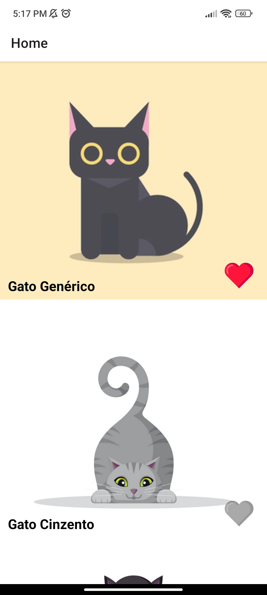
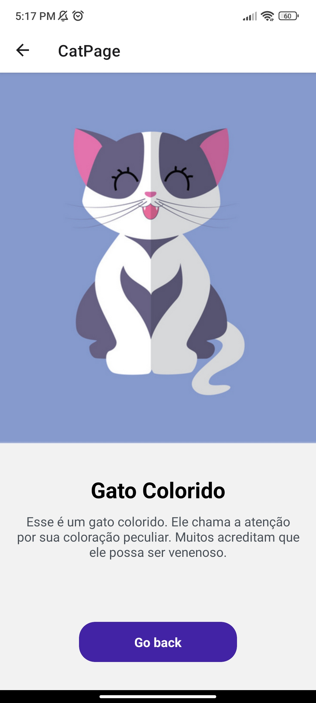

# cat-app

A app that displays cats.

Made with React Native and Expo CLI. For navigation, React Navigation was used.

<h2 align="center">Screenshots</h2>
<div align="center">
  
  
  
</div>

## How to run it locally

Have Node.js installed. More info on how to install Node.js [here](https://nodejs.org/en).
On Android devices, Expo Go need to be installed on the device. More info on how to install Expo Go [here](https://expo.dev/client).

If you have all prerequisites, clone this repository:

```bash
git clone https://github.com/mateus-sartorio/cat-app
```

To install all project dependencies, inside the project directory, run:

```bash
npm install
```

Start the Expo server with:

```bash
npm start
```

Now you have to scan the QR Code generated with the iPhone camera app or with the Expo Go app on android devices. 

## License:

This program is free software: you can redistribute it and/or modify it under the terms of the GNU General Public License as published by the Free Software Foundation, either version 3 of the License, or (at your option) any later version.

This program is distributed in the hope that it will be useful, but WITHOUT ANY WARRANTY; without even the implied warranty of MERCHANTABILITY or FITNESS FOR A PARTICULAR PURPOSE.  See the GNU General Public License for more details.

You should have received a copy of the GNU General Public License along with this program.  If not, see <https://www.gnu.org/licenses/>.

This program is released under license GNU GPL v3+ license.

## Support:

Please report any problems or suggestions about the project in its repository at [github.com/mateus-sartorio/cat-app](https://github.com/mateus-sartorio/cat-app).
